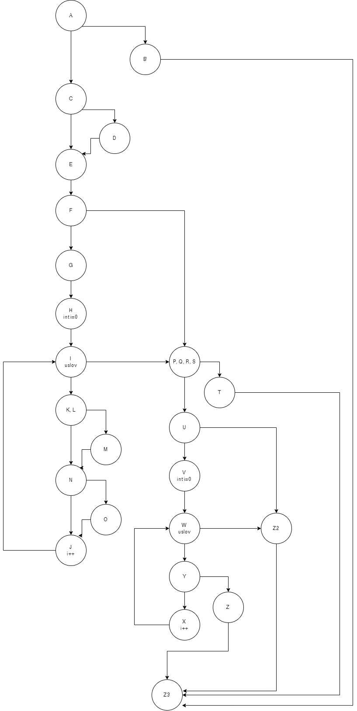
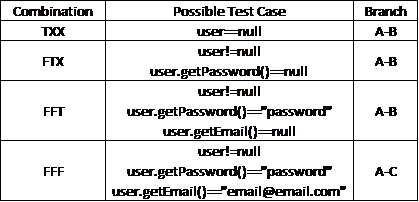

# Matej Melovski 216034

## Барање 2:

## Барање 3:
Цикломатската комплексност на кодот е 11. Се добива преку формулата E-M+2, каде Е е бројот на ребра на графот, а М е бројот на јазли. Во кодот Е=33, а М=24, па 33-24+2=11

## Барање 4:

### test case 1: user.getPassword()==null:
Во овој test case, пасвродод на корисникот е null, па условот 'if (user==null || user.getPassword()==null || user.getEmail()==null)' ќе биде точен, па програмата ќе отиде на 'throw new RuntimeException("Mandatory information missing!");'. Со ова ќе се фрли exception и ќе заврши програмата.

### test case 2: user.getPassword()=="password", user.getEmail()=="email@email.com", user.getUsername()==null:
Во овој test case, user има password="password" и email="email@email.com", а username=null, па условот 'if (user==null || user.getPassword()==null || user.getEmail()==null)' нема да биде точен, па програмата ќе скокне на условот 'if (user.getUsername()==null)', овој услов е точен, па програмата ќе отиде на 'user.setUsername(user.getEmail());'. Со ова, username=email. Програмата ќе одите на условот 'if (user.getEmail().contains("@") && user.getEmail().contains("."))' што е точен, па програмата ќе отиде на циклусот 'for (int i=0;i<allUsers.size();i++)' што ги поминува сите корисници во листата allUsers, што во овој пример има само еден корисник, а тоа е user. Бидејќи allUsers.size()==1, циклусот ќе се изврши еднаш, па програмата ќе отиде на условот 'if (existingUser.getEmail() == user.getEmail())' што ќе провери дали маилот на user во листата е еднаков со маилот на user. Во овој пример условот е точен, па програмата ќе отиде на 'same += 1;'. Од тука, програмата ќе отиде на условот 'if (existingUser.getUsername() == user.getUsername())' што ќе провери дали username на user во листата е еднаков со username на user. Во овој пример условот е точен, па програмата ќе отиде на 'same += 1;'. Од тука ќе заврши циклусот па програмата ќе отиде на условот 'if (passwordLower.contains(user.getUsername().toLowerCase()) || password.length()<8)' што не е точен, па програмата ќе отиде на условот 'if (!passwordLower.contains(" "))' што е точен, па програмата ќе отиде на циклусот 'for (int i = 0; i < specialCharacters.length(); i++)' што ќе ги помине сите специјални карактери. Во циклусот програмата ќе отиде на условот 'if (password.contains(String.valueOf(specialCharacters.charAt(i))))'. Овој услов не е точен во ниеден дел од циклусот, па програмата ќе отиде на 'return false;'. Со ова ќе заврши програмата.

### test case 3: user.getPassword()=="!password", user.getEmail()=="email", user.getUsername()=="username":
Во овој test case, user има password="!password", email="email" и username="username", па условот 'if (user==null || user.getPassword()==null || user.getEmail()==null)' нема да биде точен, па програмата ќе скокне на условот 'if (user.getUsername()==null)', што нема да е точен, па програмата ќе скокне на условот 'if (user.getEmail().contains("@") && user.getEmail().contains("."))', што нема да е точен, па програмата ќе продолжи до условот 'if (passwordLower.contains(user.getUsername().toLowerCase()) || password.length()<8)' што не е точен, па програмата ќе оди на условот 'if (!passwordLower.contains(" "))' што е точен, па програмата ќе отиде на циклусот 'for (int i = 0; i < specialCharacters.length(); i++)' што ги поминува сите специјални карактери. Во циклусот програмата ќе отиде на условот 'if (password.contains(String.valueOf(specialCharacters.charAt(i))))'. Овој услов е точен кога ќе провери дали карактерот '!' се наоѓа во пасвордот, па програмата ќе отиде на 'return same == 0;'. Со ова ќе заврши програмата.

### test case 4: user.getPassword()=="!pass", user.getEmail()=="email", user.getUsername()=="username":
Во овој test case, user има password="!pass", email="email" и username="username", па условот 'if (user==null || user.getPassword()==null || user.getEmail()==null)' нема да биде точен, па програмата ќе скокне на условот 'if (user.getUsername()==null)', што нема да е точен, па програмата ќе скокне на условот 'if (user.getEmail().contains("@") && user.getEmail().contains("."))', што нема да е точен, па програмата ќе продолжи до условот 'if (passwordLower.contains(user.getUsername().toLowerCase()) || password.length()<8)' што е точен, па програмата ќе отиде на 'return false;'. Со ова ќе заврши програмата.

### test case 5: user1.getPassword()=="! password1", user1.getEmail()=="email@email.com", user1.getUsername()=="username1", user2.getPassword()=="! Password", user2.getEmail()=="smth@smth.com", user2.getUsername()=="username2":
Во овој test case, user1 има password="! password1", email="email@email.com" и username="username1", па условот 'if (user==null || user.getPassword()==null || user.getEmail()==null)' нема да биде точен, па програмата ќе скокне на условот 'if (user.getUsername()==null)', што нема да е точен, па програмата ќе скокне на условот 'if (user.getEmail().contains("@") && user.getEmail().contains("."))' што е точен, па програмата ќе отиде на циклусот 'for (int i=0;i<allUsers.size();i++)' што ќе ги помине сите корисници во листата allUsers. Бидејќи allUsers.size=1, циклусот ќе се изврши само еднаш. Во циклусот, програмата ќе отиде на условот 'if (existingUser.getEmail() == user.getEmail()' што проверува дали маилот на корисникот во листата, што во овој пример е user2 со email="smth@smth.com" е еднаков со маилот на user1. Овој услов не е точен, па програмата ќе отиде на условот 'if (existingUser.getUsername() == user.getUsername())' што проверува дали username на корисникот во листата, што во овој пример е user2 со username="username2" е еднаков со username на user1. Овој услов не е точен, па со тоа ќе заврши циклусот, па програмата ќе продолжи до условот 'if (passwordLower.contains(user.getUsername().toLowerCase()) || password.length()<8)' што не е точен, па програмата ќе оди до условот 'if (!passwordLower.contains(" "))' што не е точен, па програмата ќе оди до 'return false;'. Со ова ќе заврши програмата.

## Барање 5: 
if (user==null || user.getPassword()==null || user.getEmail()==null)

### test case 1: user==null:
Во овој test case, user=null, односно нема корисник, па условот ќе е точен, па програмата ќе отиде по реброто A-B

### test case 2: user!=null, user.getPassword()==null:
Во овој test case, постои корисник, но password=null, па условот ќе е точен, па програмата ќе отиде по ребро A-B

### test case 3: user!=null, user.getPassword()=="password", user.getEmail()==null:
Во овој test case, постои корисник, кои има password="password", но нема емаил, па условот ќе е точен, па програмата ќе отиде по ребро A-B

### test case 4: user!=null, user.getPassword()=="password", user.getEmail()=="email@email.com":
Во овој test case, постои корисник, кои има password="password" и email="email@email.com", па условот нема да е точен, па програмата ќе отиде по ребро A-C
